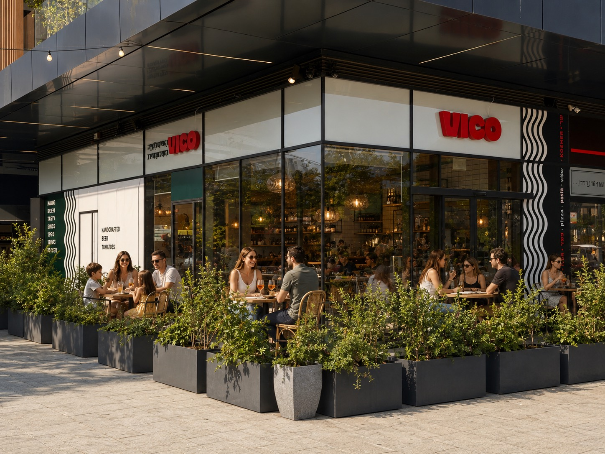

# VICO — "Coming Soon" landing page

A standalone implementation of `VICO Coming Soon.dc.html`, imported from the
Claude Design project and built into a production-ready static page.

VICO is a neighborhood kosher Italian restaurant (Pizza · Pasta · Wine),
Est. 2026, Herzliya. The page is Hebrew-first and fully right-to-left.

## Run it

```bash
python3 -m http.server 8791
```

Then open http://localhost:8791/index.html — any static file server works;
the page has **no build step and no runtime dependencies**.

## Structure

```
index.html                     The whole page: markup, component CSS, signup JS
assets/
  logo-clean-color.svg         Wordmark (hero)
  favicon-cream-on-green.svg   Favicon + footer mark
  bottom-bg-with-waves-…​.svg   Sage-green wave divider
ds/                            VICO design system (imported)
  styles.css                   @imports the four token files below
  tokens/
    fig-tokens.css             Brand colors from Figma variables
    colors.css                 Semantic color aliases
    typography.css             @font-face + type scale
    spacing.css                Spacing / radius / shadow / motion
  assets/fonts/                Kedem Sans (he), SG Bascho, DM Serif Display
```

The page links the design-system token CSS directly, so brand changes made in
`ds/tokens/*` flow through automatically.

## What the page does

- **Hero** with a photo slot, brand wordmark, and a "שומרים לי מקום" CTA that
  smooth-scrolls to the signup.
- **Signup** ("השולחן הראשון"): validates first name + Israeli mobile number,
  stores the lead in `localStorage` (`vico_first_table_signup`), then shows a
  success state with a WhatsApp share. Returning visitors see the saved state.
- **Analytics**: pushes `landing_view`, `hero_cta_click`, `signup_success`,
  `whatsapp_share`, `jobs_phone_click` to `window.dataLayer` (GTM-ready),
  with `?source=` / `?campaign=` picked up from the URL.
- **Jobs** section with a click-to-call number, and a footer with Instagram.

Configure the phone number and Instagram URL in the small `CONFIG` object at
the top of the `<script>` in `index.html`.

## Adding real photography

Image areas currently use on-brand placeholders (the design system's
convention when no photography is supplied). To use real photos, replace each
`.slot` block with an ``:

```html
<!-- e.g. the hero background -->
<div class="hero__media" aria-hidden="true">
  
</div>
```

## Notes from the import

- Two font files — `SGBascho-Slant.ttf` (italic wordmark, unused here) and
  `BigShoulders-VariableFont.ttf` (`--font-display`) — exceeded the import
  channel's per-file size cap and were omitted. `--font-display` falls back to
  Kedem Sans, which the design system already lists as its display fallback, so
  there is no visible change on this page.
- The photos that had been dropped into the original design's image slots live
  in an oversized sidecar that couldn't be pulled through the import channel;
  branded placeholders stand in for them (see above).
